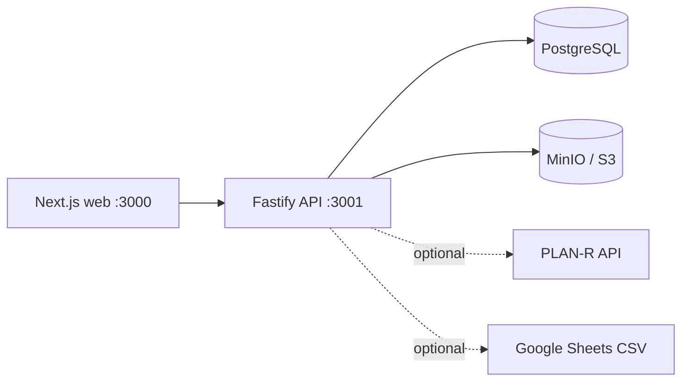

# Система отчётности о ходе строительства

[](https://github.com/Kirill-Elmanov/construction-progress-report/actions/workflows/ci.yml)

Веб-приложение для подготовки еженедельных отчётов о ходе строительства: от ввода проектных показателей и факта выполнения до проблематики, фотоотчёта, S-кривой и формирования PDF.

Репозиторий опубликован как портфолио-проект. Все данные локального демо вымышлены. Реальные токены, ключи, фотографии и сведения о проектах в репозиторий не входят.

## Что умеет приложение

- ведение проектов, подрядчиков, разделов работ и недельных отчётов;
- разграничение прав для администратора и участников проекта;
- фиксация версий разделов и аудит изменений;
- контроль прогресса, бюджета, ресурсов, проблем и предписаний;
- фотоотчёт с подписями и датами;
- ручной график работ и S-кривая «план / факт / прогноз»;
- формирование итогового PDF-отчёта;
- опциональные интеграции с PLAN-R и опубликованными Google-таблицами.

## Технологии

TypeScript, Next.js, React, Fastify, PostgreSQL, Prisma, Docker Compose, MinIO, PDFKit, Turborepo и pnpm workspaces.



## Самый простой запуск на Windows

Visual Studio Code не нужен. Для локального запуска потребуются только:

1. [Node.js LTS](https://nodejs.org/en/download) версии 20 или новее;
2. [Docker Desktop](https://docs.docker.com/desktop/setup/install/windows-install/) — после установки его нужно запустить;
3. pnpm 9.12.0:

```powershell
npm install --global pnpm@9.12.0
```

### Вариант 1 — скачать ZIP без Git

1. На странице репозитория нажмите **Code → Download ZIP**.
2. Распакуйте архив и откройте PowerShell в полученной папке.
3. Выполните:

```powershell
powershell -ExecutionPolicy Bypass -File .\scripts\demo.ps1
```

### Вариант 2 — клонировать через Git

Установите [Git for Windows](https://git-scm.com/download/win), затем выполните:

```powershell
git clone https://github.com/Kirill-Elmanov/construction-progress-report.git
cd construction-progress-report
powershell -ExecutionPolicy Bypass -File .\scripts\demo.ps1
```

Скрипт сам:

- создаст локальный `.env` из безопасного примера;
- запустит PostgreSQL и MinIO в Docker;
- установит зависимости;
- применит миграции;
- добавит вымышленный проект и заполненный отчёт;
- запустит API и веб-интерфейс.

После сообщения о готовности откройте [http://localhost:3000](http://localhost:3000).

**Демо-логин:** `demo.admin@example.test`

**Демо-пароль:** `DemoPassword123!`

Проверка API: [http://localhost:3001/health](http://localhost:3001/health).

Чтобы остановить приложение, нажмите `Ctrl+C`, затем выполните:

```powershell
powershell -ExecutionPolicy Bypass -File .\scripts\demo-stop.ps1
```

## Ручной запуск

Если автоматический скрипт недоступен:

```powershell
Copy-Item .env.example .env
docker compose up -d
pnpm install --frozen-lockfile
pnpm db:deploy
pnpm db:seed:demo
pnpm dev
```

Повторный запуск `pnpm db:seed:demo` безопасно пересоздаёт только демонстрационный проект с зарезервированным UUID. Другие проекты не удаляются.

## Как показать проект на собеседовании

Надёжнее всего заранее запустить демо на своём ноутбуке и проверить вход. Во время показа достаточно запустить Docker Desktop, открыть PowerShell в папке проекта и снова выполнить `scripts\demo.ps1`. Работодатель сможет также самостоятельно повторить запуск по инструкции выше.

На компьютере, где совсем ничего нельзя устанавливать, локальный проект запустить нельзя: ему нужны Node.js и контейнер базы данных. Для показа без установки потребуется отдельная облачная публикация приложения и базы данных — это другой сценарий развёртывания.

## Конфигурация и безопасность

- `.env` никогда не коммитится; публикуется только `.env.example` с локальными демонстрационными значениями.
- PLAN-R и Google Sheets для демо не требуются: соответствующие переменные оставлены пустыми.
- Локальные логин и пароль предназначены только для демонстрации. В production их использовать нельзя.
- Не добавляйте в Git токены, API-ключи, сертификаты, реальные фотографии и выгрузки.
- Если секрет когда-либо попал в коммит, одного удаления из файла недостаточно: секрет нужно отозвать и заменить.

Основные настройки находятся в `.env`. Индивидуальные интеграции можно включить локально, заполнив переменные по примеру, но реальные значения нельзя публиковать.

## Проверки для разработчика

```powershell
pnpm typecheck
pnpm test
pnpm build
```

## Структура репозитория

- `apps/web` — интерфейс Next.js;
- `apps/api` — REST API на Fastify;
- `packages/db` — Prisma schema, миграции и seed;
- `packages/shared` — общие типы, расчёты и валидация;
- `functions/pdf-generator` — заготовка отдельного PDF-генератора;
- `docs` — обезличенная техническая документация.

## Ограничения демо

Локальное демо работает без внешних интеграций. Обновление данных из PLAN-R и Google Sheets требует собственных разрешённых адресов и токенов. Значения в демонстрационном проекте не относятся к реальным компаниям или объектам.

## Лицензия

Исходный код опубликован для ознакомления с портфолио автора. Отдельная лицензия на использование и распространение пока не предоставлена.
